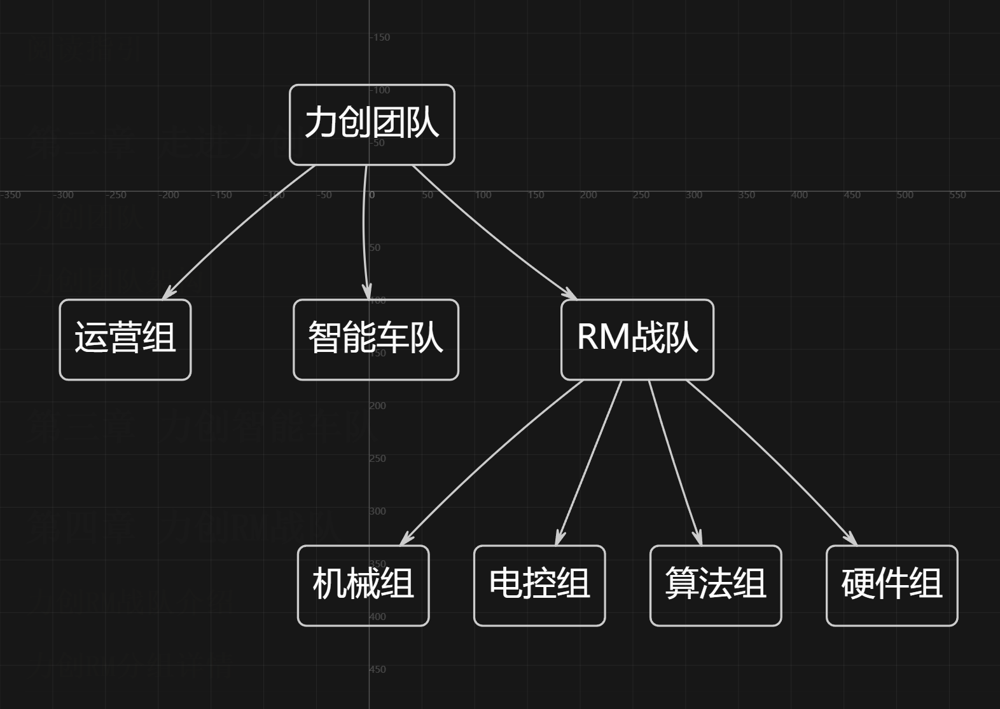
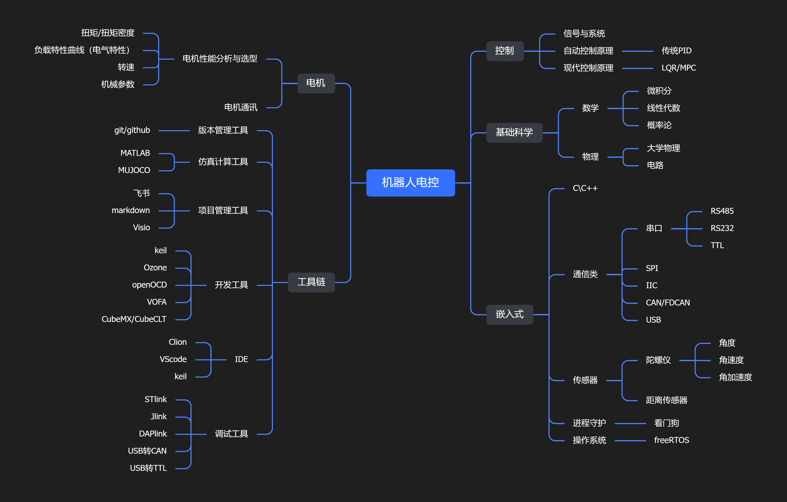
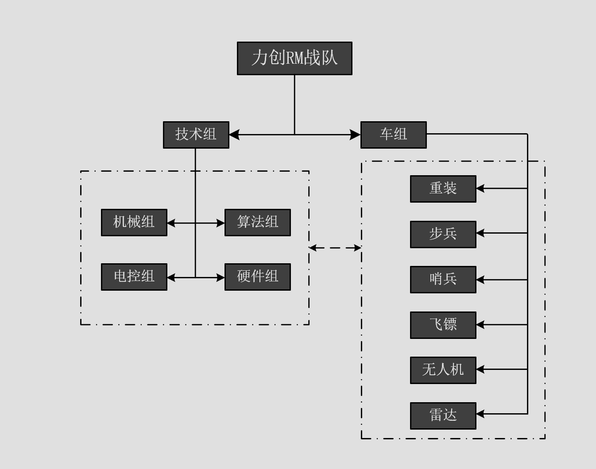

# 第一章 前言与阅读指引

## 前言

​    先说一句实在话：这本手册不是圣经，它只是学长学姐们走过的路。

​    我们给大家提供这么一本手册，不是为了告诉你“必须要这样走”，而是想给你一张地图。当你学了一段时间，想要停下来想一想的时候，能知道自己在哪、下一步可以向何处出发。

​    还有一件事，可能比具体技术更重要：在力创，不管你是学机械、电控、算法还是硬件，都要习惯“暂时不懂”。你第一次看数据手册，可能翻三页就晕；第一次调 PID，可能波形一直抖；第一次画 PCB，可能封装都找错。以后进了智能车或 RM，这些场景你都会遇到。这很正常——不是因为你不行，只是因为你暂时不知道。

​    翁恺老师有一句话说的非常好，笔者非常受用：

​    ”学计算机一定要有一个非常强大的心理状态。计算机的所有东西都是人做出来的，别人能想得出来，我也一定能想得出来。在计算机里头没有任何黑魔法，所有东西只不过是我现在不知道而已，总有一天我会把所有的细节、所有的内部的东西全都搞明白的。“

​    这句话放到力创也一样。机械结构、电路板、电机控制、视觉算法，没有一样是黑魔法。别人能想出来的，你也能想出来。今天搞不明白的，明天继续搞。

## 阅读指引

​    最重点读第三章、第四章、第五章。

​    第三章智能车队，第四章是RM战队。这两章讲的是不同部门的方向差异与具体的技术路径。如果你现在还不知道选什么，细读这两章，你会慢慢有感觉。

​    第五章是新生培养体系。它讲的是“怎么走”——通识阶段学什么、什么时候分流、分流后每个组学什么。这三章读明白了，整个实验室的分工架构和你的学习路径就清楚了。

​    其余章节怎么用：

​    第二章是团队整体介绍和架构图，快速翻一遍即可。

​    第六章是知识谱系，相当于一张技能树。你现在看可能会对很多名词有些陌生，但不要害怕，待通识课程结束，再回来看，会更有体会。

​    三条阅读路线：

| 你的情况      | 怎么读                   |
|:---------:|:---------------------:|
| 只想快速了解全部  | 读第一章+第二章+每章末尾的“一段话总结” |
| 已经对某个组感兴趣 | 直接跳到第三章或者第四章对应小节      |
| 想全部深入了解   | 按顺序读，每节末尾有总结，不会迷失     |

​    这本手册不需要从头读到尾。你可以任何地方停下来，想清楚再继续。

# 第二章 走进力创

## 力创团队

​    湖北工业大学机械工程学院力创团队成立于 2013 年 10 月，直属于湖北工业大学机械工程学院团委，是由 2012 级一部分执着于科技创新的学生,在老师的指导下组成小团队经过不断发展壮大组建而成。其宗旨是面向我校本科教育，建成一个支持学生课外科技活动、各类国家级竞赛、以及参加国际上各种制作大赛的技术支撑平台。团队的创建是为了提升学生的自主学习能力，让学生真正做到学思合一，知行合一，在学中做，做中学，调动全院及全校同学参与实践创作的积极性，为同学们进行科技创作创造条件，为促进学校人文建设，营造良好的学术科技氛围做出贡献。

## 力创团队架构

# 第三章 力创智能车队

## 力创智能车队介绍

智能车竞赛是国内高校经典的本科生电子科创赛事，核心任务就是制作一辆自主小车，让它不靠人为遥控，依靠传感器感知赛道，自主识别路线、避障、过弯，完整跑完整个赛道。课堂学习是知识点喂到你手上，而智能车竞赛绝大部分能力，都是在一次次踩坑、调试、重做当中练出来的。

智能车队内部划分为**软件组**和**硬件组**两大方向。两个方向并不是完全割裂的，大量比赛现场的问题，都是软硬件互相影响产生的。大一刚进入通识阶段，不用立刻就给自己钉死在某一个方向上，建议两个方向的基础内容都简单接触一遍，实操过后再结合自己真实感受做分流选择。如果学有余力，完全可以做到软硬件兼修，这在后期调试、备赛的时候会是巨大优势。但切记，兼修不等于入门阶段两边平均用力。

## 智能车队分组详情

### 软件组

软件组相当于智能小车的“大脑与神经”，决定小车如何读取外界信息、如何思考、如何控制电机做出动作。
主要学习内容：**C语言、单片机、上位机**。

C语言是整个嵌入式开发的地基。很多同学高中或者大学课堂学过一点C，但课堂练习题和竞赛嵌入式C完全不是一回事。课本更多侧重算法逻辑，而竞赛C要考虑单片机有限内存、运行时钟，要注意时序、位操作、内存占用。指针、结构体、枚举、位操作、函数模块化是你绕不开的重点。不要只看书看懂就觉得学会了，看懂和亲手敲出来跑通中间隔着很大距离。

单片机就是小车实体的大脑，我们把写好的C代码编译烧录进单片机芯片。由单片机完成读取传感器原始数据、数据滤波运算、输出PWM控制电机转速、对外通信等全部工作。刚上手你一定会遇到很多迷惑现象：代码编译零报错，小车就是一动不动；传感器数值毫无规律乱跳；电机转速忽快忽慢；明明实验室调试正常，一装上车架就疯狂出错。遇到这类问题不要第一时间怀疑教材或者例程，要学会利用串口打印，把中间数据打出来，一步一步缩小bug范围。

上位机属于我们的可视化调试工具。它的作用是把单片机上传回来的数据在电脑上绘图展示，比如传感器采样数值、PID输出波形。举个实际场景：小车直线跑的很好，一到弯道就冲出赛道，单纯看小车跑，你猜不出问题根源；通过上位机观察波形，你就能看到是传感器采样延迟，还是控制参数不合适。新生前期不需要独立开发完整上位机，首要目标是学会看懂波形、会使用现成工具分析问题；能力提升之后，再学习简单上位机功能开发。

#### 软件组学习路线

1. **通识前期：夯实C语言基础**
   重点吃透基础语法：循环、分支、数组、结构体、指针、位运算。不要只做纸上习题，一定要电脑敲代码跑起来。可以写一些小demo，比如串口打印、简单的数据处理程序。这个阶段目标：看得懂嵌入式风格代码，不会被指针、位操作直接劝退。很多人后面单片机学不动，根源就是C语言基础薄弱。

2. **通识中期：单片机基础实验入门**
   熟悉单片机开发环境，从最简单的点灯、按键检测开始；依次掌握IO口、定时器、串口通信、PWM输出、ADC采样这些最核心外设。完成电机简单启停调速实验。这个阶段核心目标：理解单片机程序运行逻辑，明白每一行代码对应硬件上发生了什么，建立软件和硬件之间的映射，而不是单纯复制粘贴例程。

3. **通识后期：接触智能车相关例程**
   阅读车队前辈留下的智能车基础工程，读懂传感器读取、电机驱动的现成代码。不要一上来就大改整体逻辑，优先修改参数，观察小车行为发生什么变化。熟练使用串口和上位机采集查看数据，能够独立定位简单软件bug。目标：能读懂整套工程框架，清楚各个模块分别干什么。

4. **分流之后：专项深度训练**
   完整接手智能车项目工程，学习闭环控制、滤波算法；调试小车巡线、过弯、减速等整套运行逻辑；独立负责某一块功能模块的编写、测试、迭代。同时养成写注释、模块化拆分代码的工程习惯，备赛阶段跟着队伍反复实车测试，处理赛道带来的各种现实问题。

#### 学软件能带给你的实际好处

1. **极强的问题拆解与排错能力**。做智能车软件，大部分时间不是写新功能，而是排查bug。长期训练后遇到复杂问题不会直接放弃，懂得把大问题拆成一个个小环节，分段定位故障，这种思维不管学习工作都通用。
2. **实打实嵌入式项目履历**。单片机、嵌入式C、传感器调试、PID控制，都是嵌入式开发岗位高频技能。无论是后续找实习、秋招求职，这些竞赛项目可以直接写进简历，有真实的东西可以讲。
3. **对考研复试有加成**。很多控制、电子、机械电子方向的复试，老师很喜欢问科创竞赛经历，你手上有完整做过的项目，远比空泛的成绩单更有说服力。
4. **建立工程化编码习惯**。摆脱课堂零散练习题模式，学会模块化编程、合理注释、版本管理，贴近工业实际开发的思维，而不是只追求“跑出来就行”。

### 硬件组

硬件组负责打造小车的“躯体”，所有供电、传感器、电机驱动电路板，都出自硬件组之手。对比软件对着电脑写代码，硬件组更加看重**动手实操能力**，纸上看得再明白，不上手焊接调试都不算掌握。
主要学习内容：原理图与PCB电路板绘制、电路板焊接、硬件故障调试。

画电路板分为原理图绘制和PCB布局布线两步。原理图要理清各个元器件之间电气连接关系；PCB就是最终拿去工厂加工的板子文件。新手高频踩坑：元器件封装尺寸选错，板子加工回来元器件根本装不上去；走线布局不合理，电机工作带来巨大电磁干扰，哪怕软件代码写得再完美，小车也会疯狂异常。画板不能只追求连线连通，还要考虑电源稳定性、信号抗干扰、散热、后期安装到车架的物理尺寸。

焊接是硬件的基本功，没有捷径，只能靠多练习。新手阶段手抖、虚焊、焊盘短路、烫坏元器件都是常态。从简单直插电阻电容练起，再过渡到贴片器件，慢慢练习贴片芯片焊接。板子焊接完成不等于任务结束，还要自己上电做检测，使用万用表测量通断、各个点位电压，排查短路、虚焊等各类硬件故障，条件允许的情况下还要会借助示波器观察信号质量。

#### 硬件组学习路线

1. **通识前期：基础电路与软件入门**
   认识电阻、电容、二极管、三极管、芯片等常用元器件；看得懂简单原理图；熟悉PCB绘图软件，练习绘制最简单的LED小电路。重中之重是吃透封装概念，养成每一个元器件都核对数据手册封装尺寸的习惯，封装错误是新人画板最高发错误。目标：可以独立完成简单小电路原理图+PCB绘制，理解打板的完整流程。

2. **通识中期：焊接基础与基础仪器使用**
   大量练习手工焊接，先练直插元器件，熟练之后练习贴片0805、0603封装器件，慢慢尝试焊接简单贴片芯片。学会万用表使用，会测量通断、电压，能排查简单的短路、虚焊故障。牢记安全习惯：上电之前先测有没有短路，避免一通电直接烧坏元器件。目标：拿到一块空PCB板，能独立完成焊接，排查简单硬件故障。

3. **通识后期：临摹成熟电路板，理解设计思路**
   参考车队往届成熟的电路板工程，临摹复刻简单的功能板。重点去理解电源电路怎么设计、信号线路怎么布局，为什么某些线要走的短，为什么电源和信号要分开。完整走一遍：画原理图→画PCB→输出加工文件→拿到板子焊接调试的全流程。目标：看得懂智能车驱动板、传感器板的原理图，能复刻简单功能。

4. **分流之后：独立设计与项目实战**
   根据智能车整车实际需求，独立设计传感器板、电机驱动板等功能电路板。完成画板、提交打板、焊接、硬件调试整套流程。和软件组配合，解决实车跑起来才暴露的问题：比如电机带来的电源扰动、信号干扰、供电压降等现实硬件问题。学会查阅芯片数据手册，根据实际需求选型器件，而不是只会照搬旧工程。

#### 学硬件能带给你的实际好处

1. **硬核动手工程能力**。以后课程设计、自己做小发明，你可以自己设计加工电路板，不用完全依赖现成的淘宝模块，不再只会做“模块拼接玩家”。
2. **就业选择面广**。PCB硬件设计、硬件测试、嵌入式硬件相关岗位，非常看重画板、焊接、调试这类实操项目经历，竞赛经历是简历亮眼加分项。面试的时候你可以拿出自己画过的板子实物来讲项目。
3. **看得懂电子产品底层逻辑**。拿到一块陌生电路板，可以看懂大致电路功能，看得懂芯片手册，能理解市面上很多电子设备底层原理，而不是只会调用黑盒子模块。
4. **可以辅助排查跨域故障**。懂硬件之后，小车出问题，你可以快速分辨到底是硬件供电、接线问题，还是软件逻辑的bug，不会出现软硬件组员互相甩锅的情况。

### 软硬件兼修

我们非常鼓励学有余力的同学走软硬件兼修路线，但是在这里给大一同学一个很实在的提醒：**千万不要刚进实验室，就想着软硬件两边齐头并进深度钻研**。

如果你C语言还写得磕磕绊绊，焊贴片板子还经常虚焊短路，就同时两边都想学深，最后大概率两边都学的浮于表面，什么都懂一点，但什么都没法独立干活。

比较合理的节奏：通识阶段，两个方向的基础都体验一遍；分流之后优先选定一个主方向，把主方向的能力打扎实，能够独立完成本方向的任务之后，再抽出课余时间拓展另一方向的内容。

软件为主的同学，可以学习基础画板焊接，至少看得懂原理图，能处理简单硬件故障，不至于一出板子问题就完全依赖硬件组员。硬件为主的同学，建议看懂基础单片机代码，明白代码大概做了什么，可以快速区分故障来源。

真实的比赛备赛现场，软硬件问题经常纠缠在一起。一块板子供电不稳，会让软件出现莫名其妙的报错；软件IO配置错误，看起来又很像硬件损坏。懂两边的人，排查问题的效率会高出一大截，也是团队里面非常稀缺的人才。

> 一段话总结：智能车队分为软件组与硬件组。软件组主攻C语言、单片机、上位机，核心锻炼代码编写、逻辑分析与调试排错；硬件组主攻PCB画板、焊接、硬件调试，重点打磨动手实操能力。优先深耕一个主方向，基础牢固之后再拓展另一方向。不要追求样样浅尝辄止。竞赛练出来的工程实操能力，无论竞赛备赛、课程学习、考研还是未来求职，都是属于你自己实打实的硬实力。

# 第四章 力创RM战队

## 力创RM战队介绍

## 力创RM分组详情

### 机械组

### 电控组

电控组（也可以称为控制组或者嵌入式组）接下来我将从电控组的知识体系、组内架构、工作流和项目内容进行介绍：

#### 知识体系

上图是电控组成员在战队中会接触到的知识内容。

#### 组内架构

由于RoboMaster（后用RM代指）的赛事特性和竞技强度对组间配合提出了极高的要求，LCRM战队（后面用RM战队代指）采用技术+车组的管理架构方便各兵种的项目研发。各兵种项目组由技术组中人员抽调组成，在日常技术开发的过程中，可以根据实际需要和项目难度进行人员调整。如下图

因此电控组只负责日常的人员管理、进度管理和技术分享，面向项目的项目管理、成本控制、质量管理都交由车组进行管理。  
*电控组组长*（现由曾俊涵担任，通讯：QQ：1179866242）的职责主要涵盖技术规划、人事管理、物资与成本控制、进度跟进、技术问题解决及新队员培养等多个方面，具体包括以下内容：  

    技术规划与方案制定：负责技术组短期及长远进度规划，制定技术方案，把控电控组整体技术方向。
    
    人事与团队管理：决定各组人事安排，负责新队员的招新选拔和技术培养，需考虑队员能力、性格等因素合理分配车组。
    
    物资与成本把控：管理本组物资日常事务，把控成本及财务支出（如物资购买审批、代理付款）。
    
    场地与进度管理：安排实验室主要场地卫生，通过开会、发通知等方式跟进各车组研发进度与技术情况。
    
    技术问题解决：带领团队解决和攻克技术问题，确保研发过程中技术难点的突破。
    
    培养与传承：作为电控组培养计划的主要完善者，负责新人培养及整体电控方案把控，协助战术组培养操作手。   

电控组正式队员主要负责各车组的电控部分开发、技术分享以及在冬训和夏训（对应冬季短学期和夏季短学期）的技术指导和梯队考核  
梯队队员主要学习和协助正式队员进行完整项目的开发，在冬训和夏训是进行独立模块的开发和汇报，表现优异这可以晋升为正式队员
#### 工作流
在电控组内，为了实现高效的工作交流和学习模式，我们使用统一的STM32芯片开发架构进行项目开发：*CubeMX-CMake-Ozone*同时使用*git*进行版本管理，同时我们要求在开发的过程中需要保存项目开发文档进行项目的回溯和交接（文档格式一般使用markdown）。
对于梯队队员和新生青训阶段我们依旧推荐使用传统的CubeMX+MDK-ARM（keil5）的开发方式进行学习和项目开发。
#### 项目内容
电控组的项目内容主要围绕各兵种展开，接下来我们通过一个视频来了解一下各兵种吧： 
  
（兵种介绍）
https://www.bilibili.com/video/BV18kdPBiEsy/?spm_id_from=333.1387.upload.video_card.click&vd_source=c37d999257ecafe1d4effaf1879f28d2  
在电控的角度，我们一般以机器人的控制特性分为：步哨电控、重装电控、飞镖电控

---
##### 步哨
步兵机器人和哨兵机器人因为其相似的战斗属性和规则限制，在电控层面具有很大的相似性。在发射机构上，由于两者都发射17mm小弹丸，因此都采用轻量化的云台和发射机构设计，以实现云台的快速响应。在底盘控制上，我们追求高机动性，因此我们使用功率控制策略，对底盘轮组进行能量管理达到最佳的能效比。  

---
##### 重装
由于27赛季将工程机器人和英雄机器人合并产生新的重装机器人，因此重装机器人融合了工程机器人和英雄机器人的职能，既需要完成高难度的机械臂操作任务，也需要完成高精度的42mm大弹丸发射任务，因此在控制方面我们需要完成机械臂的姿态解算和运动控制，以及云台增稳控制。 

---
##### 飞镖系统
飞镖系统在控制方面我们主要注重于镖体的控制，包括数字图像处理、多传感器建模、飞行姿态控制和落点预测。  

-----
当然了上述这些兵种在完成他们控制的过程中都需要我们搭建控制器和观测器以及进行机器人学的解算，总结一下我们的工作主要设计的内容有：
 
 - 机器人学（运动学、动力学解算）
 - 控制（选择和搭建控制器）  
 - 状态机和决策树（搭建控制逻辑）
 - 通讯(与裁判系统和上位机进行通讯（也就是传说中的联调）)

--  --
#### 在电控组你能接触到什么？？？？
在电控组你可以接触到：
 - 基于STM32的嵌入式开发
 - 控制原理
 - 机器人学
 - 机器人控制完整开发流程和项目管理

你还会使用到：

- C/C++
- CubeMX/CubeCLT等代码生成工具
- openOCD/Ozone等调试工具
- MATLAB数学计算和模型构建工具  

你可能最终会获得：
 - 良好的代码习惯
 - 完整的项目开发经验
 - 严谨的问题分析能力
 - Debug和问题排除能力
 - 团队协作开发能力
----
#### 一个电控组成员应该具备的能力和素养
1. **扎实的数学和算法基础** 重视高数、线性代数、概率论、空间几何、数据结构等基础知识，能够理解算法背后的数学原理，而不是只会调用接口。
2. **扎实的编程基础** 熟练掌握 C/C++，能够独立完成程序编写、调试和问题排查，并逐渐建立规范的代码习惯。
3. **较强的自主学习能力** 面对陌生知识，能够主动查阅文档、论文、教程和源码，把“不会”逐渐变成“会”。
4. **会学习开源，而不是照搬开源** 可以参考优秀开源项目，但要理解它为什么这样设计、每个模块解决什么问题，并尝试自己实现和改进。 **开源应该是老师，而不是拐杖。**
5. **理解 AI 的能力边界，善于使用 AI 工具** 熟练使用 AI 辅助编程、学习、检索和分析，但能够判断 AI 给出的内容是否正确，不盲目复制生成结果。 **让 AI 成为提高效率的工具，而不是替代自己思考的大脑；成为 AI 的驾驭者，而不是 AI 的依赖者。**
6. **重视基础，再逐步进入项目** 不追求一上来就做“大项目”。先补基础，再通过一个个小项目验证知识，最终构建完整系统。
7. **具备问题分析与建模能力** 遇到问题时能够拆解问题、分析输入输出、寻找误差来源，而不是只靠不断调参数尝试解决。
8. **有实验和数据意识** 算法效果不能只靠“感觉”。学会记录数据、设计实验、对比结果，用数据判断方案是否真正有效。
9. **具备基本的工程能力** 逐渐掌握 keil、MATLAB、Git、CMake、VOFA、CAN抓包器、webots、MUJOCO等工具，让算法不仅“能跑”，还能够稳定、实时地运行。
10. **养成良好的文档习惯** 无论是学习还是工程项目，都应该及时记录。学习时记录知识、公式、理解和踩坑；项目中记录设计思路、接口、参数、问题、解决方案和测试结果。 **不要让解决过的问题，再重新解决第二遍。**
11. **保持独立思考** 不因为“学长这么写”“去年这么做”“开源代码这么实现”“AI 是这么说的”就停止思考。技术问题最终应该回到原理、实验和数据。

Robomaster不单单是赛场，更是一个平台
因此通过RM这段经历我希望你能拥有：
**持续学习保持探索的习惯、冷静思考问题的能力、批判性的分析思维、严谨的研究方式、以及谦虚的心态和永不服输的心**。
我们希望你能从RM赛场中学到的不止是先进的技术，更多的是作为工程师的素养和品质，以及保持热爱的生活态度。  
最后引用*哈尔滨工业大学I Hiter战队*的口号来做结尾  
*极限犹可突破，至臻亦不可止*

### 算法组

欢迎你加入我们神秘的视觉组/算法组！这里将会简单介绍视觉组与视觉/算法组在RM中的工作和作用，帮助你更快地融入团队。

#### 视觉组/算法组在RM中的工作

**Robomaster** **官网**

https://www.robomaster.com/zh-CN

**Robomaster** **B站官方**

https://space.bilibili.com/20554233/upload/video

##### 视觉在各兵种中的作用

看图说话，有图有真相！先看看RM比赛场地”战场“上和视觉组有关的场地道具和交互模块吧。记住这些框框和注释，方便理解接下来出现的一些名词和概念，记不住也没关系，再回来看看。

图源RoboMaster2022超级对抗赛规则手册；有删改

##### 装甲板识别（步兵、英雄、哨兵、无人机）

由于机器人上安装的图传模块到操作手看到的第一视角的传输延迟加上操作手反应速度的滞后，操作手几乎很难手动瞄准高速运动的机器人上的装甲板。因此，视觉组在这三个兵种的研发上主要负 责装甲板的识别算法，通过处理图像找到相机视野范围内的装甲板（相机一般安装在云台上，和枪口平行放置并指向同一个方向，类似瞄准镜），进而向下位机（STM32等用于控制的 MCU,microcontroller unit,单片机）发送此装甲板的相对枪口的角度数据，电控根据此数据控制电机自动转向目标装甲板，实现装甲板的自动打击

因为图像处理、上位机和下位机的通信、电机的动作（即转向目标）、发射机构的动作（拨弹机构 旋转将弹丸推向摩擦轮+弹丸链路空隙），以及最耗时的弹丸在空中飞行，都会带来延迟，它们的 总时长最高可以达到0.5~0.7s。倘若将当前时刻识别到的装甲板相对于云台的位置原原本本地发送 给下位机进行控制，在识别到装甲板时刻之后的这段时间，对方机器人很可能已经移动到其他位置了（以步兵机器人为例，最快移动速度甚至可以达到6m/s，平均移动速度也有2~3m/s），我们打出的弹丸只会和目标装甲板擦身而过。

因此，视觉算法还需要根据对方机器人在过去一段时间的运 动状态或掌握其他的先验知识，预测对手在当前时刻后一段时间的运动趋势（即上述所有会带来迟 滞的环节的时间总和），从而提前将云台转向对应位置，实现对目标运动的预测。

当然，这些算法都是要不断改进的，虽然现在对内有完整的自瞄代码，但是也存在很多缺陷，等待你们加入视觉组后贡献你的力量

玩过空战游戏的同学可能很清楚，开火的时候都要给出一个提前量。通过理论来预测物体运动趋势最早可以追溯到 二战期间，控制论（cybernetics）之父维纳博士曾在美国空军基地研究自行防空火炮预测敌机运动 轨迹的问题，维纳滤波器（最小方差滤波器）也是在那时候被提出的

队内靶车

随着自瞄算法的不断升级进步，RoboMaster的赛场上也出现了“反自瞄”，其中的代表之一就是“小陀螺”。机器人在小陀螺模式下，云台和底盘处于分离状态，在底盘绕运动中心高速自旋的同时云台保持稳定不动。在这种情况下，视觉识别的难度会大大上升，一是自瞄很难跟上装甲板的高速转动，基本上我方机器人的云台运动会滞后于装甲板的运动；即使使用了前述的预测算法，由于装甲 板在很短的时间内就会在车身的一侧“消失“，这往往会导致预测失误，给出的提前量过大使得预测 值超出车身范围（瞄到空气）；二是即使跟随到一个装甲板后，那个装甲板随着底盘的转动很快消 失在视野中，此时就要锁定另一块装甲板，使得云台在切换目标的过程中会来回转动，无法稳定， 导致弹丸命中率下降，且从操作手的第一界面看来，整个画面不断晃动带来晕眩感，体验极差（更 有甚者直接”晕车“）。其他单位尚且可以通过”火力覆盖“的方法凭借运气击中”小陀螺“，而开火冷却 时间长、弹丸价格高昂的英雄机器人可不敢随随便便对着小陀螺开火。 因此，反“小陀螺”算法出现了：通过设计合适的策略，识别对手的机器人处于小陀螺状态，然后让 云台对准敌方机器人的中心位置而不再跟随装甲板移动。由于机器人处于“小陀螺”状态时基本上是匀速转动，这样就可在适当的时机开火（可以采用一些预测算法预测装甲板何时运动到云台所对准 的位置），提高命中率。也可以通过一段时间的检测，计算出对方机器人地盘转动的速度，从而预测出每一块装甲板出现和消失的时刻，进行打击。 当然，随着反”小陀螺“算法的出现，赛场上又开始出现反‘反“小陀螺“ ’算法如变速小陀螺、超快小陀螺（舵轮步兵）、随机转动等。哈尔滨理工大学（荣成校区）还研发出了偏心小陀螺，它的云台有 额外的平动自由度，使得转动的中心不在底盘的中心。快进到反反反反反小 陀螺 （禁止套娃）因此，今后必定需要研发出鲁棒性（健壮性）和泛化性能更好的算法，才能应对 愈发“卷”的比赛啊～

##### 能量机关（步兵）

- 在比赛场地的中央有一个风车形状的场地道具，就是能量机关。它也被称作”风车“、”神符系统“或” 大符“（大能量机关）”小符“（小能量机关）。能量机关的激活点是我方高地处的一个高台，距能量机关7m。我们需要用小弹丸按顺序连续击中五片随机亮起的扇叶的末端装甲板才可以激活能量机关。激活小能量机关能够为队伍带来50%的攻击力增益，大能量机关能为队伍提供100%的攻击力 增益和50%的防御增益。由于图传模块使用的是广角镜头，因此从操作手的第一视角看来五片扇叶 的间距非常小，再加上遥控的延迟，难以通过鼠标移动来进行打击，并且小能量机关处于匀速旋转 的状态，大能量机关更是以 0.785sin(1.884t)+1.305 的角速度旋转（在2022赛季其旋转角速度已经 修改为 ，上式的四个参数都是在一定范围内随机初始化的），操作手很难预 测其运动轨迹。两片扇叶之间的击打间隔必须小于2s，否则能量机关将会重置回到初始状态，之前 已经击打成功亮起的扇叶会直接熄灭。这便需要视觉组设计算法来识别未被击打过的末端装甲板并 对其实现自动瞄准，找准时机控制子弹的发射从而实现自动击打能量机关。

##### 哨兵（自动驾驶）

> 后面还没写完，想要继续了解可以前往robomaster官方网站

#### 算法组都会接触到什么

算法组主要负责机器人的**感知、定位、预测与决策**。

我们通过相机、激光雷达、IMU 等传感器获取环境信息，再利用计算机视觉、深度学习、状态估计、定位导航等技术，让机器人能够真正做到：

**看见目标 → 理解环境 → 判断状态 → 做出决策 → 自主完成任务**

加入算法组后，你会从基础编程开始，逐渐接触完整的机器人算法开发流程。

#### 计算机视觉

让机器人拥有“眼睛”。

你会接触：

- OpenCV 图像处理
- 相机模型与相机标定
- 坐标系与空间变换
- 目标检测与特征提取
- PnP 位姿解算
- 目标距离与姿态估计

这些知识会实际应用于装甲板识别、目标定位和自动瞄准等任务。

#### 深度学习

让机器人能够识别更加复杂的目标和环境。

你会经历完整的：

**数据采集 → 数据标注 → 模型训练 → 模型评估 → 模型部署**

并接触：

- Python / PyTorch
- CNN、YOLO 等神经网络
- 目标检测与图像分割
- 数据集制作与训练
- ONNX / TensorRT
- GPU 与嵌入式平台部署

不仅要让模型“能识别”，还要让它能够在机器人上**稳定、实时地运行**。

#### 目标跟踪与状态估计

机器人不仅需要看到目标，还需要判断目标**在哪里、怎么运动、下一刻会出现在哪里**。

你会接触：

- KF / EKF
- 状态空间模型
- 运动模型
- 噪声与协方差
- 数据关联
- 目标跟踪与运动预测

将单帧检测结果变成连续、稳定的目标状态。

#### 自动瞄准

自动瞄准是一套完整的实时机器人算法系统：

**目标识别 → 位姿解算 → 目标跟踪 → 运动预测 → 弹道解算 → 云台控制**

你会综合运用：

- 计算机视觉
- PnP
- EKF
- 坐标变换
- 运动预测
- 弹道模型
- 延迟补偿

把前面学习到的算法真正运行在比赛机器人上。

#### 激光雷达与三维感知

让机器人从二维图像走向三维环境。

你会接触：

- 点云与 PCL
- 点云滤波与处理
- 地面与障碍物提取
- 三维坐标变换
- 环境感知
- 相机与激光雷达融合

让机器人能够理解周围真实的三维空间。

#### 定位、建图与自主导航

让机器人知道：

**我在哪里？我要去哪里？应该怎么过去？**

你会接触：

- ROS2 / TF
- IMU 与里程计
- SLAM
- 激光雷达定位
- 路径规划
- 障碍物检测
- Nav2
- 多传感器融合

最终让机器人从人工遥控逐渐走向自主移动。

#### ROS2 与机器人系统

真正的机器人算法不是一个单独的程序，而是多个模块共同组成的完整系统。

你会学习：

- ROS2 Node
- Topic / Service / Action
- TF2
- Launch
- 参数管理
- rosbag
- RViz
- 多节点通信与调试

逐渐理解一个完整机器人软件系统是如何组织和运行的。

#### 工程开发能力

算法最终必须运行在真实机器人上，因此除了算法本身，还需要具备良好的工程能力。

你会长期使用：

- C / C++、Python
- Linux / Ubuntu
- Git / GitHub
- CMake
- Eigen / OpenCV / ROS2

并逐渐学习：

- Debug 与问题排查
- 多线程
- 性能分析
- 实时性优化
- CPU / GPU 加速
- CUDA / TensorRT
- 模块化软件设计

最终从：

**“代码能够运行”**

逐渐做到：

**“代码能够稳定、高效、实时地运行在机器人上。”**

#### 一个合格的算法组成员，应该具备什么？

1. **扎实的数学和算法基础** 重视高数、线性代数、概率论、空间几何、数据结构等基础知识，能够理解算法背后的数学原理，而不是只会调用接口。
2. **扎实的编程基础** 熟练掌握 C/C++、Python，能够独立完成程序编写、调试和问题排查，并逐渐建立规范的代码习惯。
3. **较强的自主学习能力** 面对陌生知识，能够主动查阅文档、论文、教程和源码，把“不会”逐渐变成“会”。
4. **会学习开源，而不是照搬开源** 可以参考优秀开源项目，但要理解它为什么这样设计、每个模块解决什么问题，并尝试自己实现和改进。 **开源应该是老师，而不是拐杖。**
5. **理解 AI 的能力边界，善于使用 AI 工具** 熟练使用 AI 辅助编程、学习、检索和分析，但能够判断 AI 给出的内容是否正确，不盲目复制生成结果。 **让 AI 成为提高效率的工具，而不是替代自己思考的大脑；成为 AI 的驾驭者，而不是 AI 的依赖者。**
6. **重视基础，再逐步进入项目** 不追求一上来就做“大项目”。先补基础，再通过一个个小项目验证知识，最终构建完整系统。
7. **具备问题分析与建模能力** 遇到问题时能够拆解问题、分析输入输出、寻找误差来源，而不是只靠不断调参数尝试解决。
8. **有实验和数据意识** 算法效果不能只靠“感觉”。学会记录数据、设计实验、对比结果，用数据判断方案是否真正有效。
9. **具备基本的工程能力** 逐渐掌握 Linux、Git、ROS2、CMake、Debug、性能分析等工具，让算法不仅“能跑”，还能够稳定、实时地运行。
10. **养成良好的文档习惯** 无论是学习还是工程项目，都应该及时记录。学习时记录知识、公式、理解和踩坑；项目中记录设计思路、接口、参数、问题、解决方案和测试结果。 **不要让解决过的问题，再重新解决第二遍。**
11. **保持独立思考** 不因为“学长这么写”“去年这么做”“开源代码这么实现”“AI 是这么说的”就停止思考。技术问题最终应该回到原理、实验和数据。

**算法组看重的，不只是你现在的能力，而是你的成长方式**

一个优秀的 RoboMaster 算法成员应该逐渐具备：

**扎实的数学基础 + 良好的编程能力 + 强大的自主学习能力 + 独立思考能力 + 工程实践能力 + 严谨的实验习惯。**

技术会不断更新，框架会不断变化，今天使用的模型和工具几年后也可能已经被替代。

但数学基础、学习能力、问题分析能力和工程思维不会轻易过时。

这也是我们希望每一个算法组成员，最终能够从 RoboMaster 中真正带走的东西。

### 硬件组

# 第五章 新生培养体系

## 第一阶段 通识知识培训

### 方向一：机械

### 方向二：控制

​    

## 第二阶段 分流与专项知识培训

### 分流（兴趣驱动）

### 大类一：智能车队

#### 

### 大类二：RM战队

#### 机械组

#### 电控组

#### 算法组

#### 硬件组

# 第六章 新生知识谱系（通识）

## 机械方向

## 控制方向
